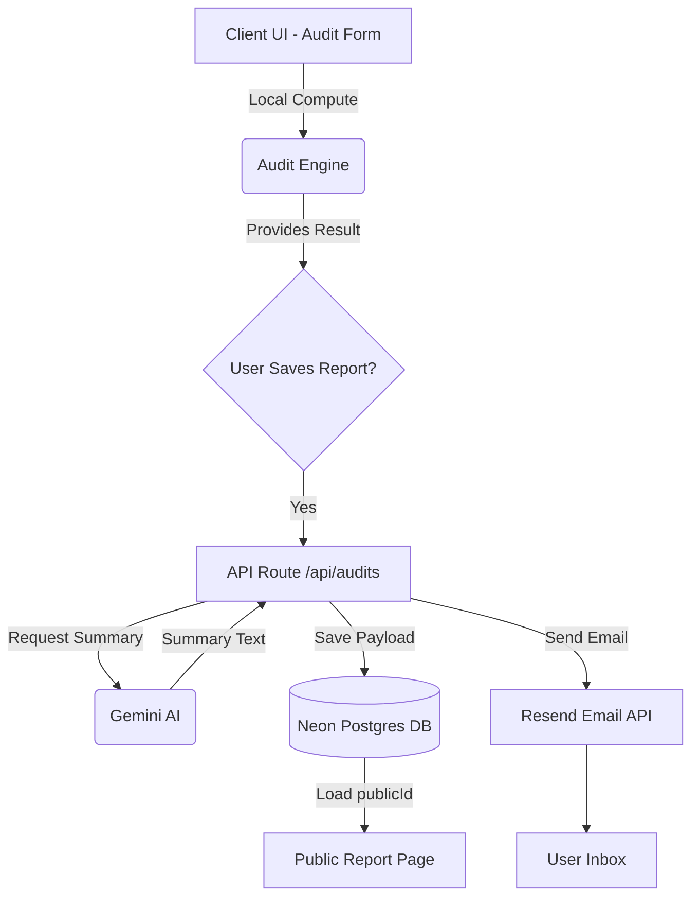

# Architecture

SpendLens AI is built to provide instant, deterministic financial analysis of a company's AI tool stack, backed by an AI-generated summary and a persistent reporting database.

## System Diagram

## Data Flow
1. **Form Input**: The user enters their team size, use-case, and a list of AI tools they are currently paying for.
2. **Audit Engine**: The client-side logic immediately calculates total spend and total savings deterministically using hardcoded pricing. No API call is made yet, ensuring immediate UI feedback.
3. **AI Summary**: If the user submits their email to save the audit, the `/api/audits` endpoint is called. The backend queries the Google Gemini API to generate a qualitative executive summary based on the deterministic numbers.
4. **Database (Neon + Drizzle)**: The original form, calculated savings, AI summary, and lead information are saved into Postgres using Drizzle ORM. A secure 16-character `publicId` is generated.
5. **Email (Resend)**: The backend sends a transactional email via Resend containing the `publicId` link.
6. **Public Report**: The `/report/[publicId]` route dynamically fetches the saved JSON payload and summary, rendering a read-only version of the audit results.

## Stack Choices
- **Next.js (App Router)**: Fast setup, server components for secure database access, and seamless API routes.
- **TypeScript**: End-to-end type safety for the audit form and pricing logic.
- **Drizzle ORM & Neon**: Lightweight, serverless-friendly database layer that scales quickly without managing connections.
- **Base UI / Shadcn**: Unstyled primitives combined with pre-designed components to achieve an accessible, premium look.
- **Vitest**: Fast, lightweight test runner for validating the deterministic audit engine.

## Scaling to 10,000 Audits/Day
If the platform scaled to 10k audits per day:
- **Database**: We would need to ensure our Neon instance has sufficient compute. Since Drizzle generates efficient queries, read performance for public reports could be augmented using Redis or Next.js static caching (ISR) since reports are immutable.
- **AI Summary**: Rate limits on the Gemini API would become a bottleneck. We would need to implement robust exponential backoff, fallback summarizers, and potentially queue the AI generation in a background worker (e.g., using Inngest or Upstash) instead of blocking the HTTP request.
- **Email**: Resend easily handles 10k emails/day, but we would implement a queuing system to avoid dropping leads if the email provider goes down temporarily.

## Security Configuration
- Secrets must be configured via environment variables only. Never hardcode API keys.
- **Note on Resend**: For demo environments, the application uses `onboarding@resend.dev`. For production, you must use a verified sender domain.
